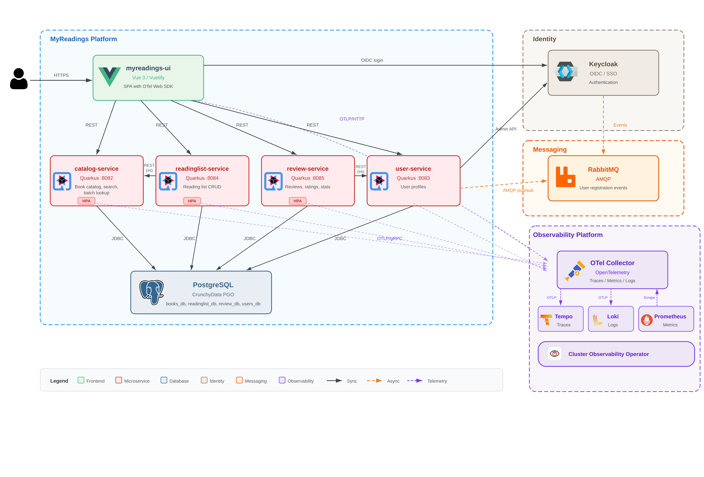
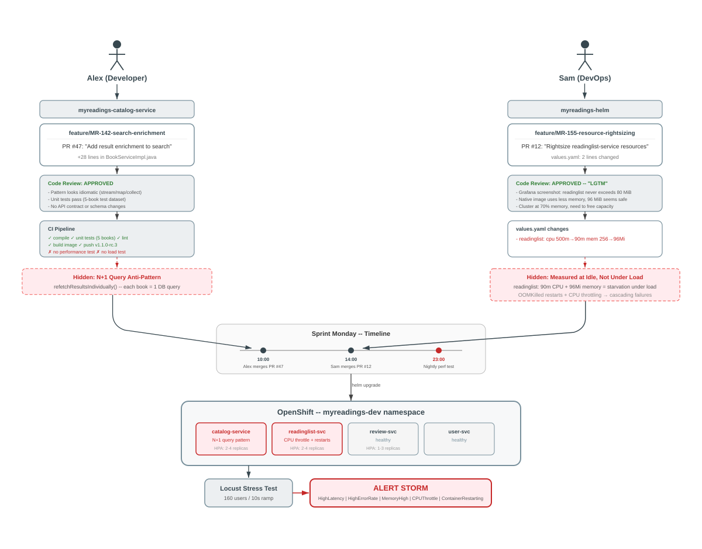

# Observability Demo - Developer Days

End-to-end observability demo on OpenShift using the **MyReadings** microservices application.
Demonstrates AI-driven incident investigation with OpenShift Lightspeed, distributed tracing with Tempo, log correlation with Loki, and dynamic dashboards with Perses.

## Architecture



The demo is deployed in four layers:

| Layer | Components |
|---|---|
| **0 — Operators** | OTel, Loki, Tempo, COO, OLS, Crunchy, RHBK, RabbitMQ |
| **1 — Platform** | UWM, LokiStack, TempoStack, Korrel8r, Perses, OLS |
| **2a — Infrastructure** | PostgreSQL, Keycloak, RabbitMQ (namespace-scoped) |
| **2b — Application** | 4 Quarkus microservices + Vue.js UI via Helm chart |

**Observability pipeline:** Apps → OTLP → OTel Collector → Tempo (traces), Loki (logs), Prometheus (metrics via pull)

### Demo error scenario



## Prerequisites

- OpenShift **4.22+** cluster with `cluster-admin` access
- **Block storage class** for LokiStack PVCs (default `STORAGE_CLASS_BLOCK=ocs-external-storagecluster-ceph-rbd`; override with your own, e.g. a Trident SC)
- **S3-compatible object storage** for Loki and Tempo buckets. Two options:
  - Any `ObjectBucketClaim` provisioner (ODF/NooBaa, Rook-Ceph, etc.) — override `STORAGE_CLASS_OBC` with your provisioner's storage class
  - External S3 (StorageGRID, MinIO, AWS S3, …) — set `USE_OBC=false`, fill in `infrastructure/01-platform/templates/external-s3-secrets.yaml` with your credentials, and apply it before deploying the platform
- Container images pre-built and pushed to a registry (default: `quay.io/rh-ee-drossi`; override via `global.imageRegistry` in the Helm chart)
- CLI tools: `oc`, `helm`, `yq`, `git`, `podman`, `python3`, `curl`, `envsubst`
- (Optional) `LLM_URL` and `LLM_API_TOKEN` for OpenShift Lightspeed

## Quick Start

All Makefile targets are **idempotent** — safe to re-run if interrupted or on error.

```bash
# Full install (operators -> platform -> infra -> app)
make deploy-all LLM_URL=https://... LLM_API_TOKEN=...

# Or step by step
make deploy-operators
make deploy-platform LLM_URL=https://... LLM_API_TOKEN=...
make deploy-infra
make deploy-app
```

Platform-only setup (no demo app):

```bash
make deploy-platform-operators
make deploy-platform LLM_URL=https://... LLM_API_TOKEN=...
```

### Overridable variables

| Variable | Default | Description |
|---|---|---|
| `STORAGE_CLASS_BLOCK` | `ocs-external-storagecluster-ceph-rbd` | Block storage class for LokiStack PVCs |
| `STORAGE_CLASS_OBC` | `openshift-storage.noobaa.io` | OBC storage class for Loki/Tempo buckets |
| `USE_OBC` | `true` | Set to `false` to skip OBC creation (external S3) |
| `KC_USERNAME` / `KC_PASSWORD` | `testuser` / `testuser` | Test user created in Keycloak for stress tests |
| `LLM_URL` / `LLM_API_TOKEN` | (none) | LLM endpoint for OpenShift Lightspeed |

## Running the Demo

```bash
# 1. Prepare OLS (pause operator, enable traces)
make prep-demo

# 2. Inject N+1 query bug + tight resource limits
make break

# 3. Start Locust for stress testing
make stress

# 4. Wait ~2-3 minutes for alerts to fire, then ask OLS:
#    "Investigate alerts in myreadings-dev"

# 5. Restore everything + unpause OLS operator
make fix-all
```

## Teardown

```bash
make destroy-app          # remove Helm release only
make destroy-infra        # remove Postgres, Keycloak, RabbitMQ
make destroy-platform     # remove LokiStack, TempoStack, OLS, UI plugins
make delete-operators     # remove operator subscriptions
make destroy-all          # full cleanup (all of the above)
```

## Known Caveats

- **OLS traces capability** — at time of writing, the Lightspeed operator does not include traces as a default MCP toolset. `make prep-demo` pauses the operator and patches the `openshift-mcp-server-config` ConfigMap to add `"traces"`. `make fix-all` unpauses the operator, which reconciles the config back to its default.

- **Korrel8r OTLP log rules** — the default Korrel8r rules expect CLF-style log labels (`kubernetes_namespace_name`, `kubernetes_pod_name`). When logs are shipped via OTLP the labels are `k8s_namespace_name` / `k8s_pod_name`. The Makefile applies custom rules (`05-korrel8r-otel-rules.yaml`) and a deployment patch (`06-korrel8r-deployment-patch.yaml`) via Server Side Apply to enable log-to-pod and pod-to-log correlation for OTLP logs.

- **Korrel8r deployment timing** — the Korrel8r deployment is created asynchronously by the Cluster Observability Operator. `make deploy-platform` waits up to 5 minutes for it to appear before applying the patch. If it isn't ready in time, re-run the patch manually.

- **Postgres after cluster reboot** — CrunchyData PGO with a single-instance cluster may leave a stale `standby.signal` file after an unclean node shutdown, preventing Patroni from promoting the instance. Run `make fix-postgres` to remove the signal file and restart the pod.

- **RabbitMQ operator** — the RabbitMQ Cluster Operator is not available in the OCP `community-operators` catalog as of 4.22. The Makefile installs it directly from the upstream GitHub manifest.

- **SCC grants** — both CrunchyData PostgreSQL and RabbitMQ require elevated SCCs (`privileged`) on OpenShift. The Makefile applies the necessary `RoleBinding`s automatically.

## Repository Layout

```
infrastructure/
  00-operators/
    platform/             o11y operator subscriptions (COO, Loki, Tempo, OTel, OLS)
    app/                  App operator subscriptions (Crunchy, RHBK) + RabbitMQ via upstream manifest
  01-platform/            Cluster-wide observability stack (LokiStack, TempoStack, Korrel8r, Perses, OLS)
  02-app-infra/           Namespace-scoped backing services (PostgreSQL, Keycloak, RabbitMQ, config jobs)
scripts/                  Setup and wait helper scripts
stress/                   Locust load test (locustfile.py)
```

The Helm chart for the application is at [MyReadings/myreadings_helm](https://github.com/MyReadings/myreadings_helm) and is cloned automatically on first `make deploy-app`.
